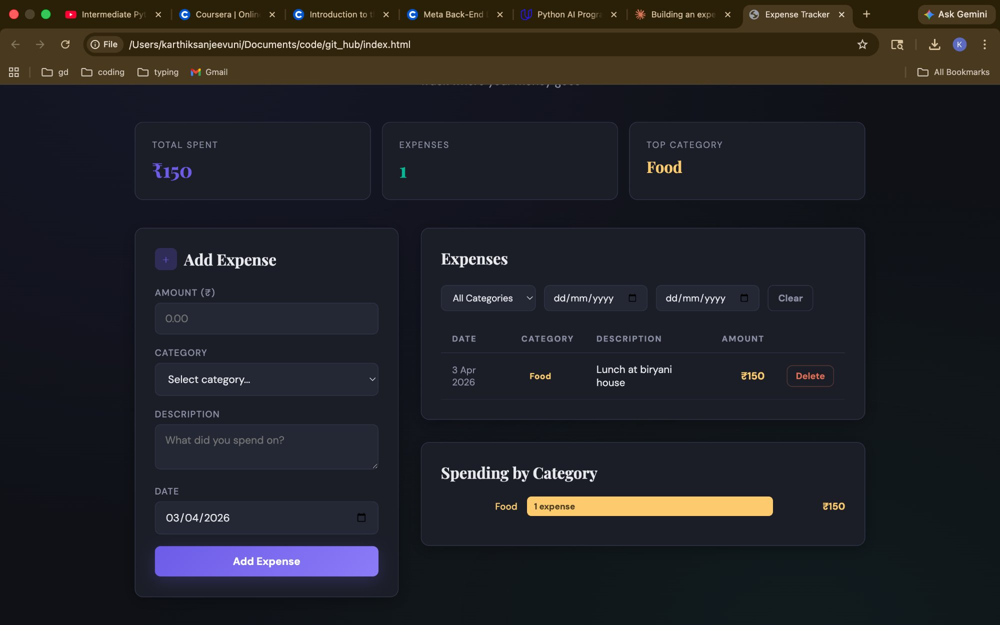

# Expense Tracker

A full-stack personal expense tracker that lets you log expenses, categorize them, filter by category or date, and see spending summaries with visual charts — all from a clean, dark-themed UI.

**Live Demo:** [https://expense-tracker-d3ms.onrender.com](https://expense-tracker-d3ms.onrender.com)



---

## Features

- **Add Expenses** — log amount, category, description, and date
- **Category Dropdown** — 9 built-in categories (Food, Transport, Housing, etc.) with auto-creation for new ones
- **Expense List** — view all expenses in a table with color-coded category badges
- **Filter & Search** — filter expenses by category, start date, or end date
- **Delete Expenses** — remove any expense with one click
- **Spending Summary** — see total spent, expense count, and top category at a glance
- **Category Bar Chart** — visual breakdown of spending by category
- **Toast Notifications** — instant feedback when adding or deleting expenses
- **Responsive Design** — works on desktop and mobile
- **Input Validation** — prevents invalid data (negative amounts, missing fields)

---

## Tech Stack

| Layer      | Technology          |
|------------|---------------------|
| Backend    | Python, Flask       |
| Database   | SQLite              |
| Frontend   | HTML, CSS, JavaScript |
| Deployment | Render              |
| Server     | Gunicorn            |

---

## API Endpoints

| Method   | Endpoint              | Description                          |
|----------|-----------------------|--------------------------------------|
| `GET`    | `/`                   | Serve the frontend UI                |
| `GET`    | `/categories`         | List all categories                  |
| `POST`   | `/expenses`           | Add a new expense                    |
| `GET`    | `/expenses`           | List all expenses (with filters)     |
| `GET`    | `/expenses/<id>`      | Get a single expense                 |
| `DELETE` | `/expenses/<id>`      | Delete an expense                    |
| `GET`    | `/expenses/summary`   | Get spending totals by category      |

### Query Parameters for Filtering

- `GET /expenses?category=Food` — filter by category
- `GET /expenses?start_date=2026-03-01&end_date=2026-03-31` — filter by date range
- `GET /expenses/summary?start_date=2026-03-01&end_date=2026-03-31` — summary for a date range

---

## How to Run Locally

### Prerequisites

- Python 3.10 or higher
- pip (Python package manager)

### Step-by-Step Setup

**1. Clone the repository**

```bash
git clone https://github.com/Shivamani1568/expense-tracker-api.git
cd expense-tracker-api
```

**2. Create a virtual environment**

```bash
python3 -m venv venv
source venv/bin/activate
```

On Windows:
```bash
venv\Scripts\activate
```

**3. Install dependencies**

```bash
pip install -r requirements.txt
```

**4. Start the server**

```bash
python app.py
```

You should see:
```
✓ Database ready at expenses.db
🚀  Expense Tracker API running on http://localhost:8080
```

**5. Open the app**

Go to [http://localhost:8080](http://localhost:8080) in your browser.

---

## Testing with curl

```bash
# Add an expense
curl -X POST http://localhost:8080/expenses \
  -H "Content-Type: application/json" \
  -d '{"amount": 150, "category": "Food", "description": "Lunch at Biryani house", "date": "2026-03-21"}'

# List all expenses
curl http://localhost:8080/expenses

# Filter by category
curl "http://localhost:8080/expenses?category=Food"

# Get spending summary
curl http://localhost:8080/expenses/summary

# Delete an expense
curl -X DELETE http://localhost:8080/expenses/1

# List categories
curl http://localhost:8080/categories
```

### Automated Tests

```bash
python test_api.py
```

Runs 34 automated tests covering all endpoints, validation, filtering, and edge cases.

---

## Database Schema

```sql
categories
├── id          INTEGER PRIMARY KEY
├── name        TEXT NOT NULL UNIQUE
└── created_at  TEXT DEFAULT datetime('now')

expenses
├── id          INTEGER PRIMARY KEY
├── amount      REAL NOT NULL CHECK (amount > 0)
├── category_id INTEGER → categories(id)
├── description TEXT
├── date        TEXT NOT NULL (YYYY-MM-DD)
└── created_at  TEXT DEFAULT datetime('now')
```

- Foreign key constraint between expenses and categories
- Indexed on `date` and `category_id` for fast filtering
- 9 default categories seeded on first run

---

## Project Structure

```
expense-tracker-api/
├── app.py              ← Flask server with all API routes + frontend serving
├── db.py               ← SQLite database setup, connection helper, seed data
├── index.html          ← Frontend UI (dark theme, charts, filters)
├── test_api.py         ← Automated test suite (34 tests)
├── requirements.txt    ← Python dependencies (Flask, Gunicorn)
├── .gitignore          ← Excludes venv, __pycache__, .db files
└── README.md           ← This file
```

---

## What I Learned Building This

- Designing a REST API with proper HTTP methods and status codes
- Connecting a Flask backend to a SQLite database
- Writing SQL queries with JOINs, GROUP BY, and aggregate functions
- Building a frontend that talks to an API using `fetch()`
- Handling CORS for cross-origin requests
- Input validation and error handling
- Deploying a full-stack app to Render
- Writing automated API tests

---

## Future Improvements

- Switch to PostgreSQL for persistent data in production
- Add user authentication (login/signup)
- Monthly budget limits with warnings
- Edit/update existing expenses
- Export expenses to CSV
- Dark/light theme toggle

---

## Author

**Karthik Sanjeevuni** — [GitHub](https://github.com/Shivamani1568)
